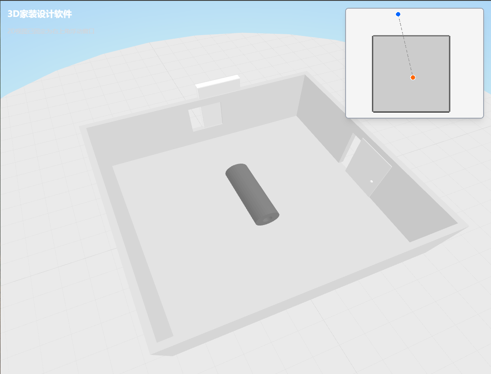

# 3D家装设计软件

一个基于Web的在线3D家装设计软件，支持BIM建模、软装布置、参数化设计、定制化和铺贴等功能。

## 🎥 项目演示



## ✨ 核心特性

- **3D场景渲染**：基于Three.js的高性能3D渲染引擎
- **2D视图协同**：PixiJS实现的2D平面视图，与3D场景实时同步
- **参数化建模**：支持参数化墙体、门窗、家具等元素
- **智能房间识别**：自动检测墙体围合区域并生成房间
- **BIM数据模型**：完整的数据驱动架构，模型与视图分离
- **实时交互**：支持拖拽、缩放、平移等交互操作

## 🛠️ 技术栈

- **3D渲染**：Three.js
- **2D渲染**：PixiJS
- **前端框架**：React + TypeScript
- **构建工具**：Webpack
- **样式**：TailwindCSS
- **几何计算**：@jscad/modeling (CSG布尔运算)

##  项目结构

```
src/
├── core/           # 数据建模层（纯数据，无展示逻辑）
│   ├── model/      # 数据模型（RoomModel, WallModel, FaceModel等）
│   ├── util/       # 工具类（RoomBuilder, ParametricModeler等）
│   └── ModelRegistry.ts  # 模型注册表
├── app/            # 展示层
│   ├── 3d/         # 3D展示逻辑
│   ├── 2d/         # 2D展示逻辑
│   └── ui/         # UI界面
└── editor/         # 编辑器主程序
```

## 🚀 快速开始

```bash
# 安装依赖
npm install

# 启动开发服务器
npm run dev
```

访问 http://localhost:3008 查看应用。

## 💡 Vibe Coding 项目

这是一个**Vibe Coding项目**，完全通过AI辅助编程完成开发。项目展示了AI编程助手在现代Web应用开发中的强大能力：

- ✅ 从零构建完整的3D家装设计系统
- ✅ 数据模型与展示层的清晰分离
- ✅ 复杂的几何计算和空间关系处理
- ✅ 2D/3D视图的双向同步
- ✅ 实时交互和状态管理

通过自然语言描述需求，AI编程助手能够快速理解并实现复杂的功能，大幅提升了开发效率和代码质量。

## 📄 许可证

MIT License
