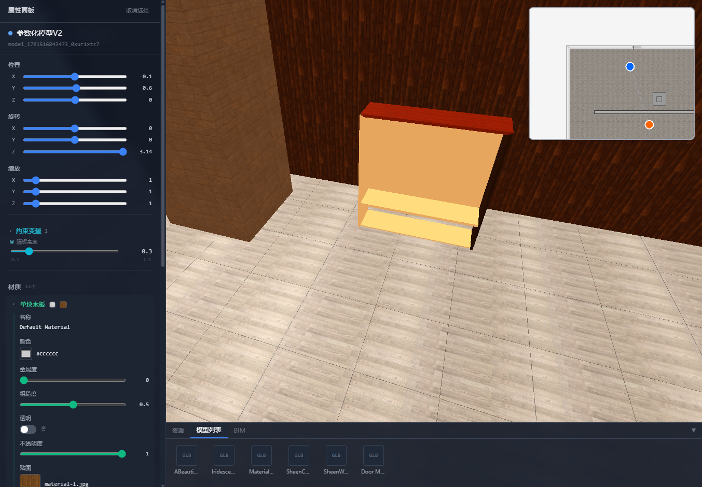
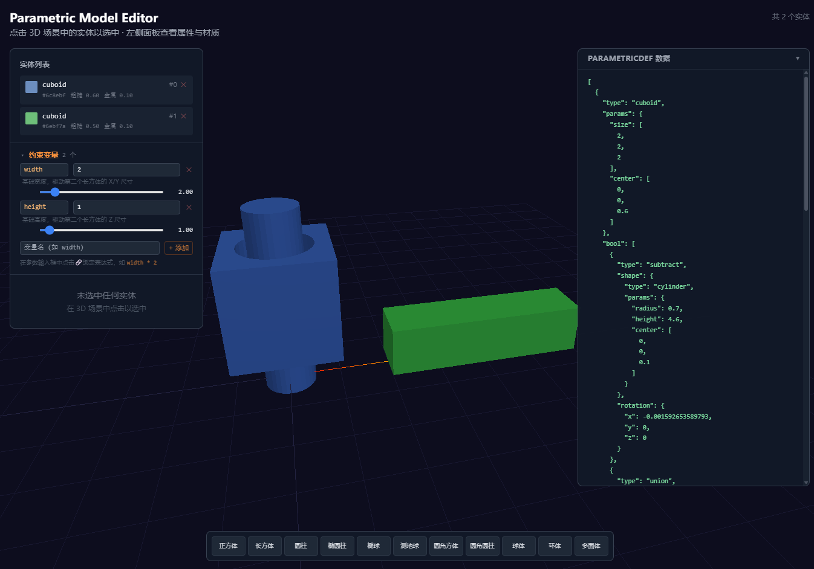

# 3D设计软件

基于Web的在线3D设计软件，支持BIM建模、软装布置、参数化设计、定制化及铺贴等功能。



## 核心特性

- **3D渲染**：基于Three.js
- **2D视图协同**：PixiJS平面视图，与3D场景实时同步
- **参数化建模**：墙体、门窗、家具
- **智能房间识别**：自动检测墙体围合区域
- **BIM数据模型**：数据驱动，模型与视图分离

## 技术栈

Three.js · PixiJS · React + TypeScript · Webpack · TailwindCSS · @jscad/modeling · npm workspaces

## Monorepo 架构

```
packages/
├── core/      # @designer/core — 数据建模层（纯数据）
├── app/       # @designer/app  — 展示层（3D/2D/UI）
├── editor/    # @designer/editor — 编辑器主程序（private）
├── pm-engine/ # @designer/pm-engine — 参数化建模引擎（基于 @jscad/modeling）
└── pm-editor/ # @designer/pm-editor — 参数化编辑器（独立轻量应用）
```

依赖链：
- editor → app → core
- pm-editor → pm-engine → core

- core/app 支持独立构建(`npm run build`)和发布(`npm run publish:dist`)
- editor 为 private，仅用于开发和最终构建
- TypeScript 通过 project references + paths 别名，开发时直引源码，发布时独立构建

## 快速开始

```bash
npm install          # 安装依赖
npm run dev          # 开发服务器 (localhost:3008)
npm run build        # 构建
npm run type-check   # 类型检查
```

## 整体架构

`core/model` 数据对象注册到 `ModelRegistry`，`app/3d/display` 为每个模型注册3D展示对象，数据创建时通过ID自动关联3D展示。

## 参数化建模系统

### pm-engine — 参数化引擎

基于 `@jscad/modeling` 的节点图参数化建模引擎，提供纯数据驱动的几何构建能力。

**核心概念：**
- `ParametricDef`：JSON 格式的几何定义（基本体类型 + 参数 + 布尔操作 + 材质 + 变换）
- `ConstraintSystem`：变量约束系统，支持用表达式绑定参数（如 `width * 2`），驱动几何体动态更新
- `buildGeometries()`：将 `ParametricDef[]` 批量转换为 JSCAD 几何体
- `buildSteps()`：输出分步构建过程，用于可视化展示布尔运算的中间结果

**支持的基本体：** 正方体、长方体、圆柱、椭圆柱、椭球、测地球、圆角方体、圆角圆柱、球体、环体、多面体

**布尔操作：** `subtract`（差集）、`union`（并集）、`intersect`（交集）

**Three.js 辅助：** 提供 `jscadToBufferGeometry`、`buildMeshGroup`、`createThreeMaterial` 等工具函数，将引擎输出转换为 Three.js 可渲染对象。

### pm-editor — 参数化编辑器

轻量级独立编辑器，直接渲染 pm-engine 的 `ParametricDef` 数据，**不依赖** `@designer/app`，仅使用 Three.js + React。



**功能：**
- 在 3D 场景中点击选取实体，拖拽移动位置
- 左侧面板：实体列表、约束变量滑块、变换/材质/参数编辑
- 右侧面板：实时展示 `ParametricDef[]` JSON 数据
- 底部工具栏：交互式添加基本体（`AddModelCommand` 预览放置）
- 约束变量实时驱动几何体更新

**快速启动：**
```bash
npm run dev --workspace=@designer/pm-editor    # 端口 3008
```

## 许可证

MIT License
