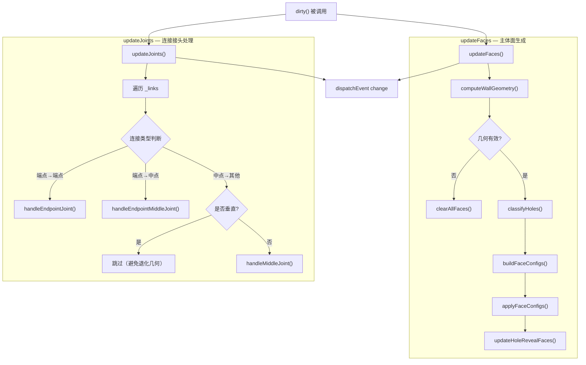
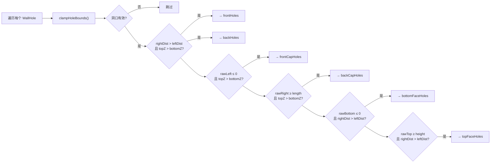
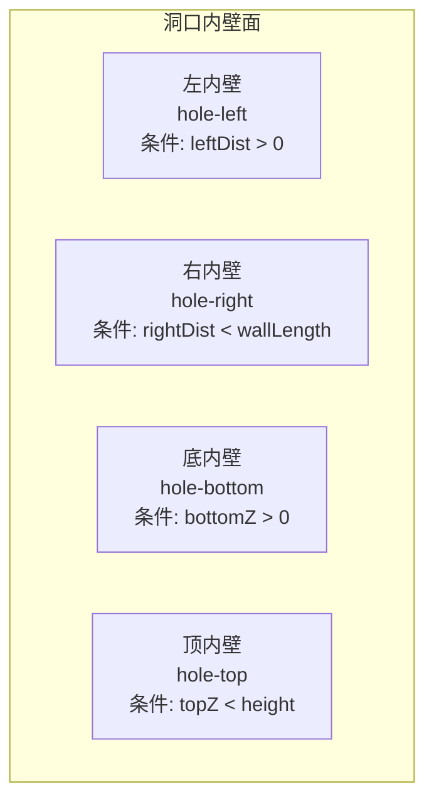
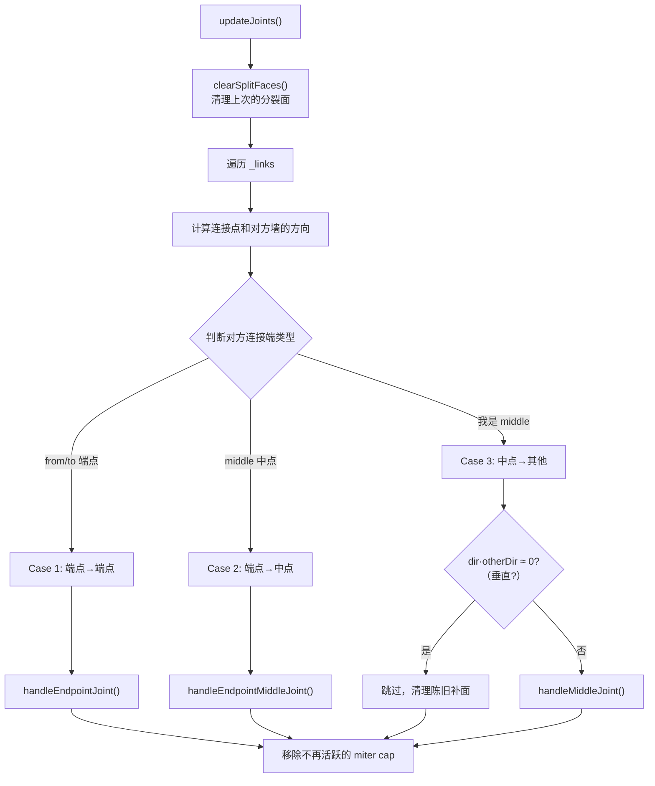
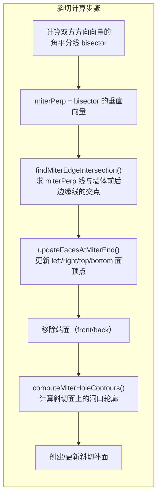
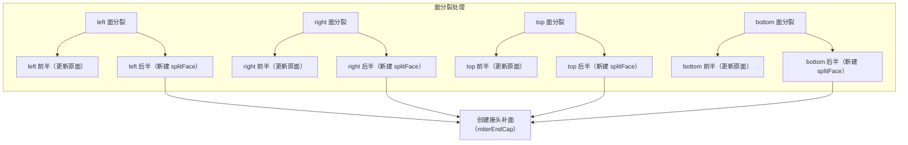
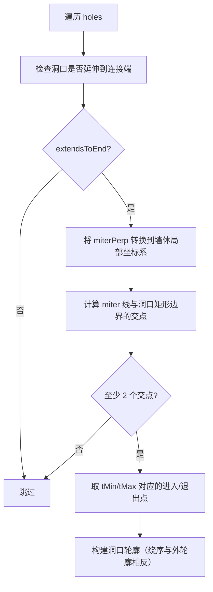
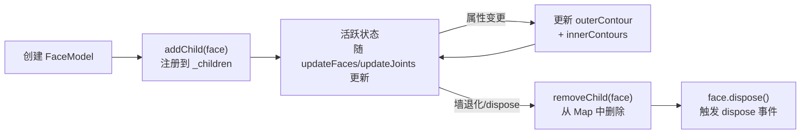
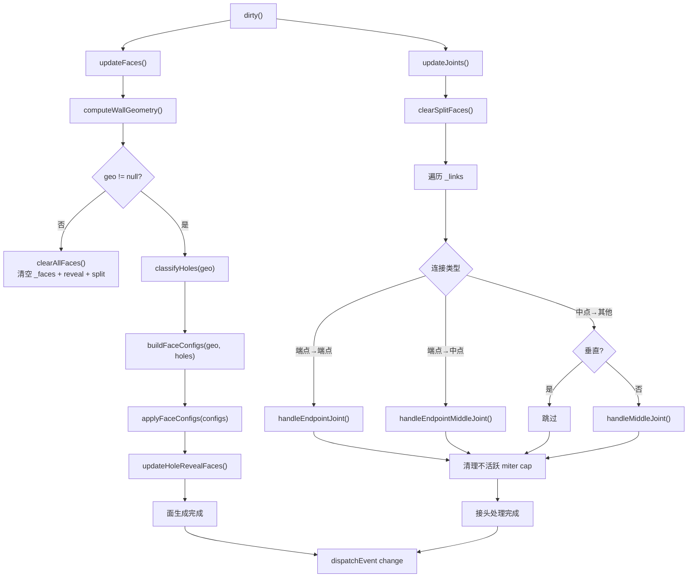

# WallModel 面生成逻辑详细说明

> 对应源文件：`packages/core/src/model/WallModel.ts`

## 1. 概述

`WallModel` 是墙体数据模型，由起点 `from`、终点 `to`、厚度 `width`、高度 `height` 四个基本属性定义。墙体在三维空间中是一个以 XY 平面为地面、Z 轴朝上的长方体，其表面被分解为 **6 个面（FaceModel）**：

| 面位置 | 含义 | 对应墙体方向 |
|--------|------|-------------|
| `left` | 左侧面（+offset 侧） | 垂直于墙体方向，法线朝 +perp |
| `right` | 右侧面（-offset 侧） | 垂直于墙体方向，法线朝 -perp |
| `front` | 前端面（from 端封口） | 垂直于墙体方向，在 from 端 |
| `back` | 后端面（to 端封口） | 垂直于墙体方向，在 to 端 |
| `top` | 顶面 | Z = height 水平面 |
| `bottom` | 底面 | Z = 0 水平面 |

除 6 个主体面外，墙体还可能生成以下附加面：

- **洞口侧面（Hole Reveal Faces）**：门窗洞口的内壁（最多 4 个/洞口）
- **斜切端面（Miter End Caps）**：墙体连接处的接头补面
- **分裂面（Split Faces）**：中点连接导致面被分割后的额外面片

---

## 2. 核心数据结构

### 2.1 WallGeometry — 几何快照

```typescript
interface WallGeometry {
    dir: THREE.Vector2;    // 归一化墙体方向 (from → to)
    perp: THREE.Vector2;   // 墙体方向的左垂直向量 (-dir.y, dir.x)
    offset: THREE.Vector2; // perp * halfWidth，中心线到面边的偏移
    length: number;        // 墙体长度
    // 底部 4 个角点 (z = 0)
    blf: THREE.Vector3; blb: THREE.Vector3; brf: THREE.Vector3; brb: THREE.Vector3;
    // 顶部 4 个角点 (z = height)
    tlf: THREE.Vector3; tlb: THREE.Vector3; trf: THREE.Vector3; trb: THREE.Vector3;
}
```

8 个角点命名规则：`[底/顶][左/右][前/后]`

```
        tlf ──────────────── trf        tlb ──────────────── trb
        /│                    /│        /│                    /│
       / │                   / │       / │                   / │
      /  │                  /  │      /  │                  /  │
     blf ──────────────── brf        blb ──────────────── brb
          ←──── length ────→
          ←─ halfWidth ─→
```

### 2.2 HoleFaceData — 洞口分类结果

```typescript
interface HoleFaceData {
    frontHoles: THREE.Vector3[][];    // left 面的洞口内轮廓
    backHoles: THREE.Vector3[][];     // right 面的洞口内轮廓
    frontCapHoles: THREE.Vector3[][]; // front 端面的洞口内轮廓
    backCapHoles: THREE.Vector3[][];  // back 端面的洞口内轮廓
    topFaceHoles: THREE.Vector3[][];  // top 面的洞口内轮廓
    bottomFaceHoles: THREE.Vector3[][]; // bottom 面的洞口内轮廓
}
```

### 2.3 FaceConfig — 面配置

```typescript
interface FaceConfig {
    position: WallFacePosition;     // 面位置标识
    vertices: THREE.Vector3[];      // 外轮廓顶点（4个，四边形）
    innerContours?: THREE.Vector3[][]; // 内轮廓（洞口）
}
```

### 2.4 WallHole — 墙体洞口

```typescript
interface WallHole {
    id: string;
    position: number;    // 洞口中心距 from 端的距离（沿墙体方向）
    width: number;       // 洞口宽度（沿墙体方向）
    height: number;      // 洞口高度
    sillHeight: number;  // 窗台高度（地面到洞口底部）
    linkModelId?: string | null; // 关联的家具模型 ID
}
```

---

## 3. 面生成总流程图



---

## 4. 面生成主流程详解

### 4.1 updateFaces() — 入口编排

```typescript
private updateFaces(): void {
    const geo = this.computeWallGeometry();
    if (!geo) {
        this.clearAllFaces();
        return;
    }
    const holes = this.classifyHoles(geo);
    const configs = this.buildFaceConfigs(geo, holes);
    this.applyFaceConfigs(configs);
    this.updateHoleRevealFaces(geo.dir, geo.offset);
}
```

**职责**：编排 5 个步骤，按顺序完成主体面的生成与更新。

| 步骤 | 方法 | 输入 | 输出 |
|------|------|------|------|
| 1 | `computeWallGeometry()` | from, to, width, height | WallGeometry 或 null |
| 2 | `classifyHoles(geo)` | WallGeometry + holes[] | HoleFaceData |
| 3 | `buildFaceConfigs(geo, holes)` | WallGeometry + HoleFaceData | FaceConfig[]（6个） |
| 4 | `applyFaceConfigs(configs)` | FaceConfig[] | 更新/创建 FaceModel |
| 5 | `updateHoleRevealFaces(dir, offset)` | dir, offset + holes[] | 创建洞口内壁面 |

---

### 4.2 computeWallGeometry() — 几何快照计算

```typescript
private computeWallGeometry(): WallGeometry | null {
    const direction = new THREE.Vector2().subVectors(to, from);
    const length = direction.length();

    if (length === 0 || height === 0 || this._width === 0) {
        return null;  // 退化墙体，返回 null
    }

    const dir = direction.clone().normalize();
    const perp = new THREE.Vector2(-dir.y, dir.x);
    const offset = perp.clone().multiplyScalar(halfWidth);

    // 计算底部 4 角点
    const blf = new THREE.Vector3(from.x + offset.x, from.y + offset.y, 0);
    const blb = new THREE.Vector3(from.x - offset.x, from.y - offset.y, 0);
    const brb = new THREE.Vector3(to.x - offset.x, to.y - offset.y, 0);
    const brf = new THREE.Vector3(to.x + offset.x, to.y + offset.y, 0);

    // 计算顶部 4 角点（z = height）
    // ...同理

    return { dir, perp, offset, length, blf, blb, brf, brb, tlf, tlb, trf, trb };
}
```

**关键逻辑**：
- `dir`：墙体方向向量归一化
- `perp`：墙体方向的左垂直向量，通过 `(-dir.y, dir.x)` 计算
- `offset`：`perp * halfWidth`，表示从中心线到面边缘的偏移量
- 返回 `null` 的条件：长度为 0、高度为 0、宽度为 0

**角点计算公式**：每个角点 = `端点 ± offset`，`+offset` 为前侧（front/+perp），`-offset` 为后侧（back/-perp）。

---

### 4.3 classifyHoles() — 洞口分类（单次遍历）

此方法对所有洞口做 **单次遍历**，将每个洞口分配到其影响的面：



**分类规则详解**：

| 条件 | 影响的面 | 说明 |
|------|---------|------|
| 洞口在墙体长度范围内有有效区域 | left, right | 侧面必定受影响（窗户/门洞穿透墙体） |
| `rawLeft ≤ 0`（洞口左边界超出 from 端） | front | 洞口延伸到 from 端面 |
| `rawRight ≥ length`（洞口右边界超出 to 端） | back | 洞口延伸到 to 端面 |
| `rawBottom ≤ 0`（洞口底部到达地面） | bottom | 洞口贯穿底面 |
| `rawTop ≥ height`（洞口顶部到达墙顶） | top | 洞口贯穿顶面 |

**buildSideHoleContour()** — 侧面洞口轮廓构建：

```typescript
private buildSideHoleContour(dir, offset, bounds, isBack): THREE.Vector3[] {
    const faceOffset = isBack ? offset.clone().negate() : offset;
    // 计算 hole 左右边界在墙体方向上的 2D 坐标
    const pLeft = from + dir * bounds.leftDist;
    const pRight = from + dir * bounds.rightDist;
    // 构建 4 个角点
    const bl = (pLeft + faceOffset, bottomZ);
    const br = (pRight + faceOffset, bottomZ);
    const tr = (pRight + faceOffset, topZ);
    const tl = (pLeft + faceOffset, topZ);
    // 关键：正反面绕序相反，确保 CSG 正确
    return isBack ? [bl, br, tr, tl] : [bl, tl, tr, br];
}
```

> **绕序规则**：背面洞口轮廓与正面绕序相反，这是 CSG 布尔运算（差集）的几何要求——内轮廓必须与外轮廓绕向相反才能正确"挖洞"。

---

### 4.4 buildFaceConfigs() — 面配置构建

将几何快照的 8 个角点和洞口数据映射为 6 个 `FaceConfig`：

```typescript
private buildFaceConfigs(geo: WallGeometry, holes: HoleFaceData): FaceConfig[] {
    const { blf, blb, brf, brb, tlf, tlb, trf, trb } = geo;
    return [
        { position: 'left',   vertices: [blf, brf, trf, tlf], innerContours: holes.frontHoles },
        { position: 'right',  vertices: [brb, blb, tlb, trb], innerContours: holes.backHoles },
        { position: 'front',  vertices: [blb, blf, tlf, tlb], innerContours: holes.frontCapHoles.length > 0 ? holes.frontCapHoles : undefined },
        { position: 'back',   vertices: [brf, brb, trb, trf], innerContours: holes.backCapHoles.length > 0 ? holes.backCapHoles : undefined },
        { position: 'top',    vertices: [tlf, tlb, trb, trf], innerContours: holes.topFaceHoles.length > 0 ? holes.topFaceHoles : undefined },
        { position: 'bottom', vertices: [blf, brf, brb, blb], innerContours: holes.bottomFaceHoles.length > 0 ? holes.bottomFaceHoles : undefined },
    ];
}
```

**角点排列示意**（从面外侧观察，逆时针绕序）：

```
left 面 (看 +perp 方向):     right 面 (看 -perp 方向):
  tlf ──── trf                 tlb ──── trb
   │       │                    │       │
  blf ──── brf                 blb ──── brb

front 面 (看 -dir 方向):      back 面 (看 +dir 方向):
  tlb ──── tlf                 trb ──── trf
   │       │                    │       │
  blb ──── blf                 brb ──── brf

top 面 (看 -Z 方向):          bottom 面 (看 +Z 方向):
  tlf ──── tlb                 blf ──── brf
   │       │                    │       │
  trf ──── trb                 brb ──── blb
```

---

### 4.5 applyFaceConfigs() — 面配置应用（复用策略）

```typescript
private applyFaceConfigs(configs: FaceConfig[]): void {
    for (const config of configs) {
        let face = this._faces.get(config.position);
        if (face) {
            // 复用已有 FaceModel，仅更新数据
            face.outerContour = config.vertices;
            face.innerContours = config.innerContours || [];
        } else {
            // 创建新 FaceModel
            face = new FaceModel(config.vertices, config.innerContours || []);
            this._faces.set(config.position, face);
            this.addChild(face);
        }
    }
}
```

**复用策略的核心目的**：
- **保持 FaceModel 实例不变**：FaceModel 上挂载的材质（Material）、铺贴区域（Paving Regions）等持久化数据不会因重建而丢失
- 仅更新 `outerContour` 和 `innerContours`，触发 `dirty()` 通知显示层刷新

---

### 4.6 updateHoleRevealFaces() — 洞口内壁面生成

每个洞口在墙体内部产生最多 **4 个内壁面**，展示墙体厚度：



**边界跳过规则**：如果洞口触及墙体边界（地面/墙顶/端面），则该方向的内壁面不生成，避免与端面/顶底面重叠。

```typescript
// 左内壁：洞口左边界未到达 from 端时生成
if (bounds.leftDist > 0) {
    revealConfigs.push({ key: `${hole.id}-left`, vertices: [fbl, bbl, btl, ftl] });
}
// 右内壁：洞口右边界未到达 to 端时生成
if (bounds.rightDist < wallLength) {
    revealConfigs.push({ key: `${hole.id}-right`, vertices: [fbr, ftr, btr, bbr] });
}
// 底内壁：洞口底部未到达地面时生成
if (bounds.bottomZ > 0) {
    revealConfigs.push({ key: `${hole.id}-bottom`, vertices: [fbl, fbr, bbr, bbl] });
}
// 顶内壁：洞口顶部未到达墙顶时生成
if (bounds.topZ < this._height) {
    revealConfigs.push({ key: `${hole.id}-top`, vertices: [ftl, ftr, btr, btl] });
}
```

同样采用 **复用策略**：已存在的 reveal face 更新顶点，不再则新建。最后清理不再活跃的 reveal face。

---

## 5. 墙体连接接头处理

### 5.1 updateJoints() — 连接入口



**连接端类型检测**（容差 0.01）：
- 对方墙的 `from` 端距连接点 < 0.01 → `from`
- 对方墙的 `to` 端距连接点 < 0.01 → `to`
- 否则 → `middle`

---

### 5.2 handleEndpointJoint() — 端点对端点（斜切接头）

两墙在端点处相交，通过 **角平分线（bisector）** 计算斜切面：



**角平分线计算**：
```typescript
const myDir = isAtFromEnd ? dir.clone().negate() : dir.clone();
const bisectorVec = new THREE.Vector2().addVectors(myDir, otherEndDir);
const bisector = bisectorVec.normalize();
const miterPerp = new THREE.Vector2(-bisector.y, bisector.x);
```

**updateFacesAtMiterEnd()** — 更新连接端的 4 个面顶点：

根据是 from 端还是 to 端，更新对应位置的顶点坐标为斜切交点：

| 面 | 顶点排列 | from 端更新索引 | to 端更新索引 |
|----|---------|----------------|--------------|
| left | [blf, brf, trf, tlf] | 0, 3 | 1, 2 |
| right | [brb, blb, tlb, trb] | 1, 2 | 0, 3 |
| top | [tlf, tlb, trb, trf] | 0, 1 | 2, 3 |
| bottom | [blf, brf, brb, blb] | 0, 3 | 1, 2 |

---

### 5.3 handleEndpointMiddleJoint() — 端点对中点（T 型接头）

本墙端点连接到对方墙的中段。计算对方墙边缘线与本墙面平面的交点：

```typescript
// 本墙前/后面平面方程：P · perp = jointPoint · perp ± halfWidth
// 对方墙前/后边缘线：P = otherFrom ± otherOffset + t * otherDir
// 求解 t 参数得到 4 个交点
const tFF = (myFrontLevel - otherFrontOrigin.dot(perp)) / denomFront;
const frontFront = otherFrontOrigin + otherDir * tFF;
// ... 同理计算 backFront, frontBack, backBack
```

**垂直 T 型接头跳过**：当 `|dir · otherDir| < 0.01`（两墙垂直）时，所有交点汇聚到接头中心，产生退化几何，因此跳过面修改。

---

### 5.4 handleMiddleJoint() — 中点对中点（十字接头）

本墙中点连接对方墙，需要 **分裂** 4 个主体面：



**分裂面存储**：新生成的面片存储在 `_splitFaces` Map 中，key 格式为 `${otherWall.id}-${linkEnd}-${face}-after`，每次 `updateJoints()` 开始时先 `clearSplitFaces()` 清理。

---

## 6. 洞口处理完整流程

### 6.1 clampHoleBounds() — 洞口边界裁剪

```typescript
private clampHoleBounds(hole: WallHole, wallLength: number) {
    const leftDist = Math.max(0, hole.position - hole.width / 2);
    const rightDist = Math.min(wallLength, hole.position + hole.width / 2);
    const bottomZ = Math.max(0, hole.sillHeight);
    const topZ = Math.min(this._height, hole.sillHeight + hole.height);

    if (rightDist <= leftDist || topZ <= bottomZ) return null;  // 完全在墙外
    return { leftDist, rightDist, bottomZ, topZ };
}
```

**作用**：将洞口坐标裁剪到墙体有效范围内，返回裁剪后的边界值。如果洞口完全在墙外，返回 `null`。

### 6.2 computeMiterHoleContours() — 斜切面洞口轮廓

在斜切接头上，如果洞口延伸到连接端，需要在斜切面上生成洞口轮廓：



---

## 7. dirty() 触发链与面生命周期

### 7.1 dirty() 触发

```typescript
dirty(): void {
    this._isDirty = true;
    this.updateFaces();    // 1. 重建主体面 + 洞口内壁
    this.updateJoints();   // 2. 重建连接接头
    this.dispatchEvent({ type: 'change', wall: this });  // 3. 通知监听者
}
```

**触发 dirty() 的属性变更**：
- `from` / `to`（位置变更）
- `width` / `height`（尺寸变更）
- `addHole()` / `removeHole()` / `updateHole()` / `clearHoles()`（洞口变更）
- `addLink()` / `removeLink()` / `clearLinks()`（连接变更）

### 7.2 面的生命周期



### 7.3 面存储结构汇总

| 存储字段 | 类型 | 内容 | 清理时机 |
|---------|------|------|---------|
| `_faces` | `Map<WallFacePosition, FaceModel>` | 6 个主体面 | clearAllFaces() / dispose() |
| `_holeRevealFaces` | `Map<string, FaceModel>` | 洞口内壁面 | clearHoleRevealFaces() / clearAllFaces() / dispose() |
| `_miterEndCaps` | `Map<string, FaceModel>` | 斜切/接头补面 | clearMiterEndCaps() / dispose() |
| `_splitFaces` | `Map<string, FaceModel>` | 分裂面片 | clearSplitFaces()（每次 updateJoints 开始） / dispose() |

---

## 8. 完整面生成流程图（含所有分支）



---

## 9. 关键设计原则

1. **FaceModel 复用**：通过 `applyFaceConfigs()` 复用已有 FaceModel 实例，仅更新顶点数据，保留材质和铺贴配置
2. **单次遍历分类**：`classifyHoles()` 对所有洞口做单次遍历，同时填充 6 类面的洞口数据
3. **绕序一致性**：外轮廓统一逆时针，内轮廓（洞口）绕序与所在面的外轮廓相反，确保 CSG 正确
4. **退化几何避免**：垂直 T 型接头跳过面修改，避免产生零宽度的退化面
5. **增量清理**：每次更新时先清理分裂面，更新完成后清理不再活跃的 miter cap 和 reveal face
6. **边界跳过**：洞口内壁面在触及墙体边界时跳过生成，避免面重叠
