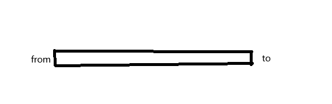
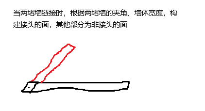
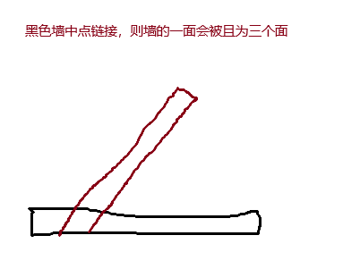
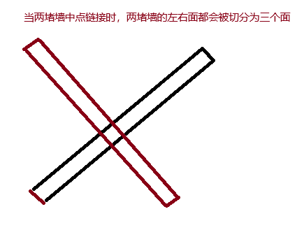

# 墙体面生成逻辑

## 墙体基本属性

- from 墙体起点
- to 墙体终点
- width 墙体宽度
- height 墙体高度
- holes 墙体的洞
- links 墙的连接点

## 墙体面生成逻辑

一个单独的墙会生成六个面，分别为底面、顶面、左面、右面、前面、后面。

2d示意图如下所示

## 墙体链接

墙体链接其他墙体有三种情况，起点链接、中间链接（起点和终点外的链接）、终点链接，这三种情况都会重构面，产生额外的面来补充接头

### 起点链接、终点链接

### 起点或终点链接中点

### 中点链接中点

